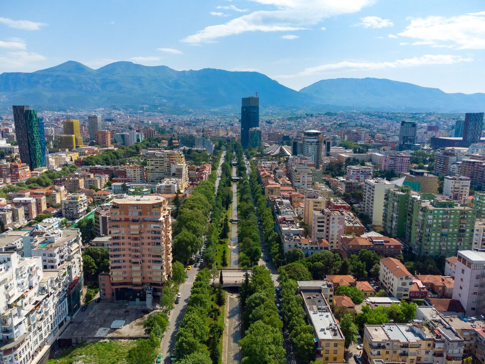

2024-08-19

---
layout: page
title: The Cross-Continental Race Using Only Public Transit
---

## Contestants in the Race Across Europe must travel from London to the Albanian capital of Tirana using only trains, buses and ferries.

This weekend marks the start of a trans-European race with a difference: Instead of the usual rally cars or racing bicycles, contestants must cross the continent using only public transit.

On Saturday, 180 racers will set off on from London’s Trafalgar Square on the second annual Race Across Europe, traveling on only trains, buses and ferries to the finish line in the Albanian capital some 1,200 miles away, Tirana. Organized by adventure travel agency Lupin Travel, the race is intended to test contestants’ ingenuity in both moving fast and thinking on their feet. Participants have to pass through four checkpoints on the way, but only the first of these, the Belgian city of Bruges, has been shared in advance.

Race Across Europe
Contestants will travel more than 1,200 miles from London to Tirana, Albania, using only public transit.

The contest attracts some hyper-competitive individuals. According to organizer James Finnity, last year’s inaugural race, from London to Istanbul, saw a few people upgrading to business class train tickets just to allow an earlier check-in for the London-Paris train. One participant seeking a prize for the most countries visited on route managed to hit a remarkable 22, including San Marino and Vatican City. Finnity says the race isn’t just for one type of traveler, however, or all about speed.

“We’re pleased to say that there’s a roughly even 50-50 gender split,” he said. “Racers’ ages range from 20-somethings up to retirees, and there are even a few families traveling with children. Some of these racers will be trying to complete the course as fast possible. We reckon it will take them roughly 3.5 days — but many of these travelers will choose to take up to a week to complete the course, stopping for nights in hotels or maybe even the odd trip to the beach.”

In an era where people are increasingly being encouraged to swap polluting planes for lower-emission modes, the Race Across Europe is also intended to highlight the pleasures and surprising ease of traveling internationally without flights. Now that it’s possible to fly from the UK to as far away as Australia nonstop, many travelers are jaded with speed alone.

With a similar concept to the Race Across Europe now powering a British TV series, people seem to be placing increasing emphasis on journeys and forms of travel as opposed to simple speed. And certainly, for anyone keen to look out the window, the way to Tirana from London is a frequently lovely one. While as-yet-unannounced checkpoints will likely skew the route, the quickest is to take a train to Turin, changing in Paris, then follow the Adriatic coast down to the port of Bari, located at the top of Italy’s heel. A short ferry ride to Durrës on the Albanian coast and you can reach Tirana by bus in around 30 minutes.

Travel as fast as you can, however, and you’ll still need some endurance. “One thing we’ve learned from the last race is that it pays to make yourself as comfortable as possible,” said Finnity, “so anyone hoping to rest along the way would do best to bring a face mask and a shoulder pillow.”