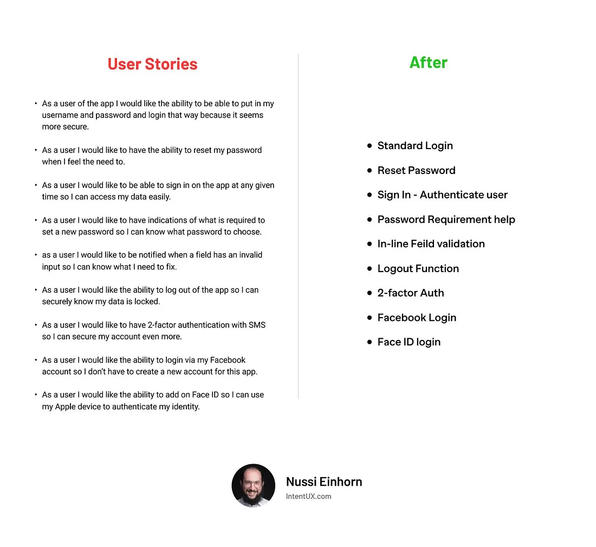

## Splitting User Stories into more User Stories often means you are deceiving yourself (and your users too!)



The left-hand side of the image portrays a confusing mess of User Stories. Try scanning them and getting the gist — you won’t.

The right-hand side of the picture showcases a crisp and clear alternative by using descriptive titles that summarize the features. Easy to read and understand.

The image brilliantly illustrates how you can apply User Stories in the wrong way, making them convoluted and difficult to understand. Unfortunately, in my experience, most people apply User Stories exactly as conveyed in the picture.

However, when you’re employing User Stories in this fashion, you’re missing their entire point and not reaping their benefits. You may be able to tick the ‘User Story’ box in theory, but in reality, it couldn’t be further removed from the User.

Let’s get to the essence of what User Stories are about to make evident why this is precisely how you shouldn’t be using them.

---

### 1.User Stories are never a work of fiction

It’s called a User Story for a reason.

It’s not called a Requirement Story, Specification Story, or Feature Story. User Stories have to be real stories about the User.

If you can invent a User Story on the spot without talking to a real user or customer first, then it’s not a User Story but a User Fairytale. It is only a figment of your imagination.

How can you expect success in the real world if you make the complete User Story up?

User Stories are a work of non-fiction, based on qualitative and quantitive data. User Stories work because they tell a factual story about who will be using the product and what they are looking to accomplish together with the expected benefit.

### 2.User Stories are not requirements vehicles or descriptions of features

How something is supposed to work is something different than what it is supposed to achieve.

Let’s refresh our memory by discussing the User Story format:

```
As a < type of user >, I want < some goal > so that < some reason >
```

User Stories describe a type of user who wants to achieve a certain goal for a specific reason. It’s not about what your product does.

Requirements and features are used to describe how the product should work. But you need to start with the customer (User Story) and work your way backward. You do this by beginning with the User Story.

The problem is, User Stories are often too big and need to be split. As we say in Agile terms, they are Epics — too large to be worked on directly and immediately.

Splitting an ‘Epic’ User Story into smaller User Stories is often a bad idea. The Epic is about the user and the benefits they expect to achieve. Then when you split it up into smaller chunks, it is often no longer about the User but how it is supposed to work. You’re effectively splitting up a User Story into a Feature Story.

In this case, User Stories are then no longer applicable. Like in the picture, they become too convoluted and complicated to be useful.

You notice this when you have difficulty expressing the smaller chunks in User Story format. You need to think hard to invent the subgoals of the user and formulate the reason behind those subgoals.

The problem is that the User often does not really care about those subgoals or the intermediate benefits the product produces, which are often only a means to an end. The User Story is framed from the perspective of the product, while the user benefit is only derived at the end of a chain of steps.

In this case, do not use a User Story to split up the work. Many superior alternatives exist that do not require you to invent subgoals and reasons far removed from what your user actually wants to achieve and why.

Here are some unheralded alternatives to User Stories:

Job Stories
Problem Stories
Improvement Stories
FDD Features

### 3.User Stories are not about what you write down
I realize this point may be counter-intuitive. Please bear with me. I’ll do my best to explain it clearly. Coming from the world of requirements and acceptance criteria, we believe the contract matters most — what we write down. If you apply User Stories only as a contract to meet, you will never realize their full benefits.

User Stories are not about what you write down but about what is understood. Common understanding should be prioritized over trying to attain a perfect contract. This is also why the Agile manifesto contains the line: ”Customer collaboration over contract negotiation”. What you initially agreed upon is less important than what you’re trying to achieve.

Without common understanding, your contract will never be perfect, even if you describe it perfectly. Does that sound strange? Allow me to elaborate.

Even with common understanding, the contract won’t be perfect, but the team is set up to maximize their chances of making the right decisions. When you do complex work, it is inevitable the contract will have flaws.

To make it even less abstract: when I started as a Product Owner, I came from a background as Software Tester and Business Analyst. Writing down how it would work was my strong suit.

Except I found, no matter how perfectly I wrote everything down, people would still make mistakes. The problem was that whatever I wrote down was my brain child, not that of the team. During refinement, the team would gaze at the long list of bullet points and stop paying attention because it looked great. Plus, they felt I had ownership of the solution and not the whole team.

It is not about what you write down, but what they understand. It may seem like a trivial distinction, but it isn’t. The conversation is what matters most. What you write down serves as a reminder of that original conversation.

When you provide a perfect User Story, the team gets lulled in a false sense of security that paying attention is less important. By writing everything together, it is a team working product, and you maximize common understanding.

Further reading:

```
Read This First - Jeff Patton & Associates
This book has no introduction. Yes, you read that right. Now, you might immediately ask yourself this question: "Why…
www.jpattonassociates.com
```

**User Stories done right**

User Stories should be at a high enough level of granularity to depict a real user goal and explain why our users want to attain that goal. Once you split User Stories, beware, as you may be entering Disneyland instead of talking about a User Story rooted in reality.

In the example at the beginning of this article, the User Stories describe a login functionality. Things like login are so foundational, basic (and commoditized) that it often doesn’t make much sense to describe them with a User Story.

You can split User Stories into more User Stories, but often you will be deceiving yourself as it will no longer be a User Story, but a Feature Story instead. That’s cool too, but great alternatives to User Stories exist that may do a better job of explaining what you are trying to do.

The most important thing you can do, regardless of what template you use for describing what you want to build, is to have a conversation. Common understanding is created by talking to each other, not by hiding behind our screens and staring at words that can and will be misinterpreted.

Whatever you write down doesn’t matter unless somebody realizes what it actually means by remembering a great conversation.

Jeff Patton has compared it to two different people viewing the same holiday photo: for who actually was there it paints a completely different picture than for the person who wasn’t there. Only by going there together can you create shared understanding and tell a story which the picture alone (or any requirements document you produce) cannot create.