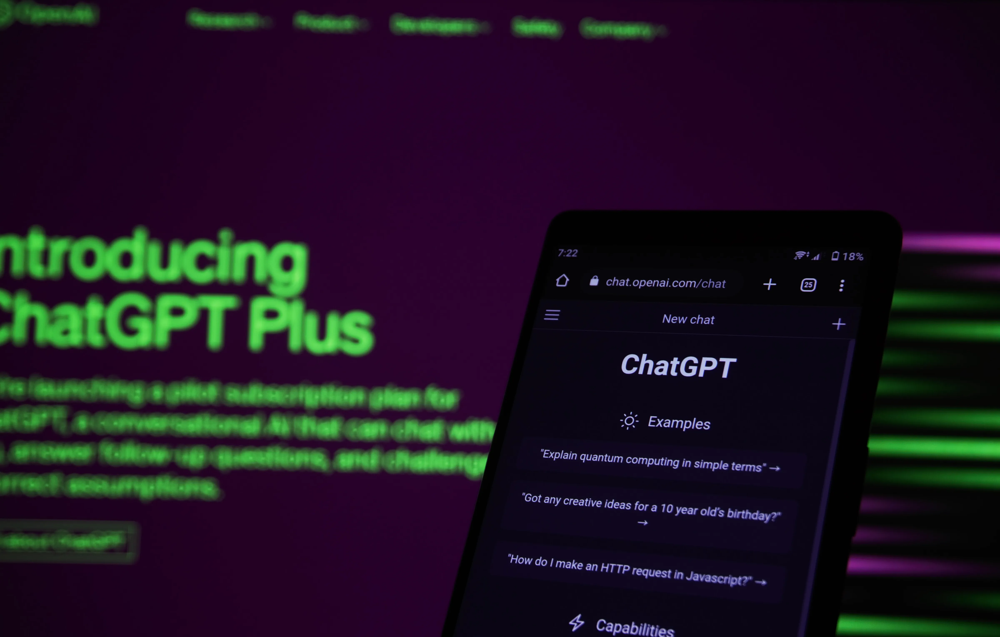

## What is Requirements Management?

The post explores what Generative AI’s capabilities mean to the practice of requirements management during the project discovery phase.

In their book Business Analysis Techniques, 72 Essential Tools for Success, the authors define Requirements Management in four categories:

Requirements Elicitation — Techniques used to investigate, identify requirements from stakeholders e.g. 1–1 interviews, prototyping
Requirements Analysis — The organisation , grouping and management of requirements, e.g. MoSCoW prioritisation
Requirements Development — Techniques to ensure that requirements are created to specific standards, e.g. adding acceptance criteria, traceability matrix
Requirements Modelling — Conceptual modelling techniques such as use case diagrams, Entity Relationship Diagrams that support textual requirements.
All four groupings / categories are evident in the project discovery phase.

## Project Discovery

The purpose of Project Discovery is to confirm project vision, goals and scope. It consists of multiple activities such as:

* Meeting the client / stakeholders — confirm project brief, vision, scope
* Project team setup — access to systems, tools, environments
* Confirming stakeholder and resource availability
* Agreeing output standards

Project Discovery typically occurs over a 2–3 week period. At the end of this period, client and project teams are aligned on vision, goals and scope. Agreed outputs, such as requirement documents, wireframes / prototypes are either complete or a timeframe has been agreed for their completion.

## What’s changed, now that there’s Generative AI?

Generative AI’s capabilities include, the ability to:

* Generate Content — text, images, audio and video
* Idea Generation — new ideas, concepts, products and services
* Summarise text into shorter more concise versions
* Aid Decision Making — answer questions, analyse sentiment
* Analyse data and generate insights

Requirement categories analysis, development and modelling can be automated with Generative AI. Utilising prompt engineering techniques, Generative AI can create user stories, use cases, ensure that acceptance criteria is added and create matching conceptual models to support requirement text.

Depending on the project, wireframes and prototyping can also be produced to elicit requirements.

The key takeaway is time saved. Outputs are created instantly for immediate feedback and validation. Assuming there’s technical input to support the outputs , gathered requirements, initial designs can be signed off in a 2 hour meeting instead of waiting to the end of the project discovery phase — 2–3 weeks!

## What does this mean for Project Discovery?

Project Discovery is an important activity.

The ability to create content to agreed standards at speed, leaves more time to discuss, evaluate and agree on project vision, goals and scope.

Prompt Engineering and Generative AI are key topics which BA’s must master / incorporate into their workflows and processes. In practical terms this means:

* Completing certified Prompt Engineering and Generative AI courses
* Keeping informed with Generative AI and Prompt Engineering updates
* Making time to play around with Generative AI tools
* Reviewing project and client processes
* Identify where Generative AI can help / automate tasks
* Document, review and evaluate prompts after each project — what worked, what didn’t / what would you improve.

To aid this, below are further learning and resource links related to prompt engineering and learning resources:

* **Top 9 Generative AI tools to redefine your content creation** — [https://www.bardeen.ai/posts/generative-ai-tools](https://www.bardeen.ai/posts/generative-ai-tools)
* **Prompt Engineering Guide** — [https://www.promptingguide.ai/](https://www.promptingguide.ai/)
* **Deep Learning AI — ChatGPT Prompt Engineering for Developers** — [https://www.deeplearning.ai/short-courses/chatgpt-prompt-engineering-for-developers/](https://www.deeplearning.ai/short-courses/chatgpt-prompt-engineering-for-developers/)

